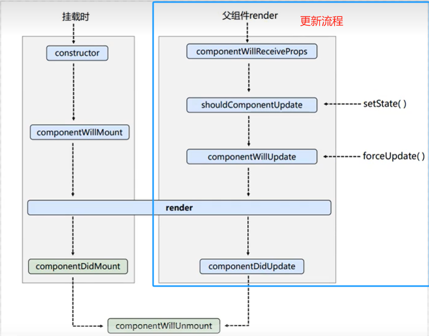
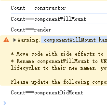
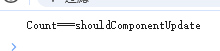
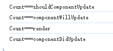
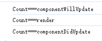
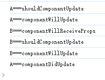

## 初始化阶段
   ### 常用 - componentDidMount() - 开启定时器、发送网络请求、订阅消息

## 卸载组件 
由ReactDOM.unmountComponentAtNode(document.getElementById("test"))触发
 ### 常用 - componentWillUnmount- 关闭定时器、取消订阅消息

## 更新阶段
### 1.setState
#### a.shouldComponentUpdate为false

#### b.shouldComponentUpdate为true

### 2.forceUpdate
不经过阀门 shouldComponentUpdate

## 3.有父类

